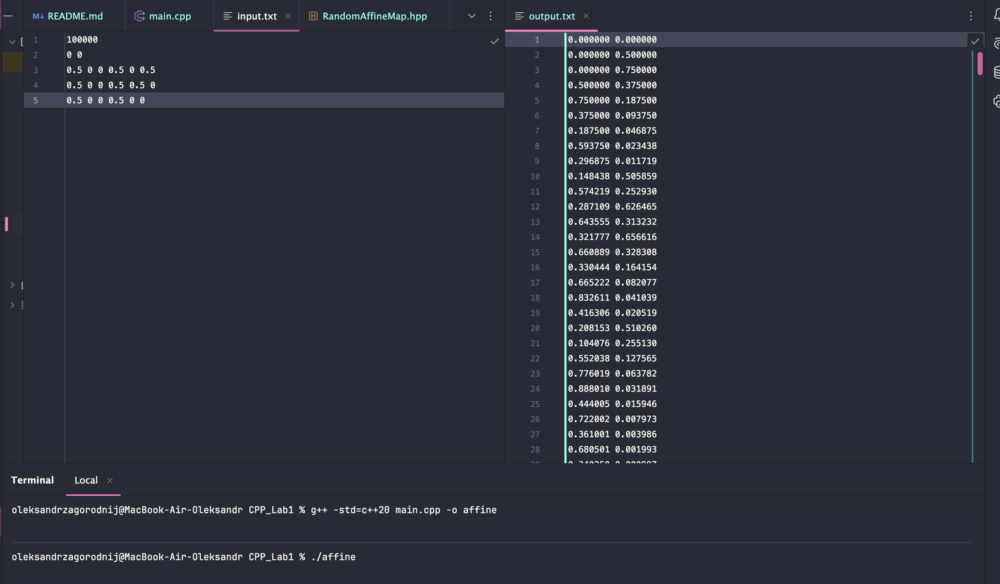

# Affine Transformations

## Authors
- Oleksandr Zahorodnyi
- Taras Syvokon  
  **Group:** K-27

## About the program
The program reads affine transformations and a starting point from `input.txt`, generates a sequence of points by applying random transformations, and writes the results to `output.txt`.



## How to run
Place `input.txt` in the same directory, then compile and run:
```bash
g++ -std=c++20 main.cpp -o affine
./affine
```
Note: You must have a compiler that supports C++20 or newer.